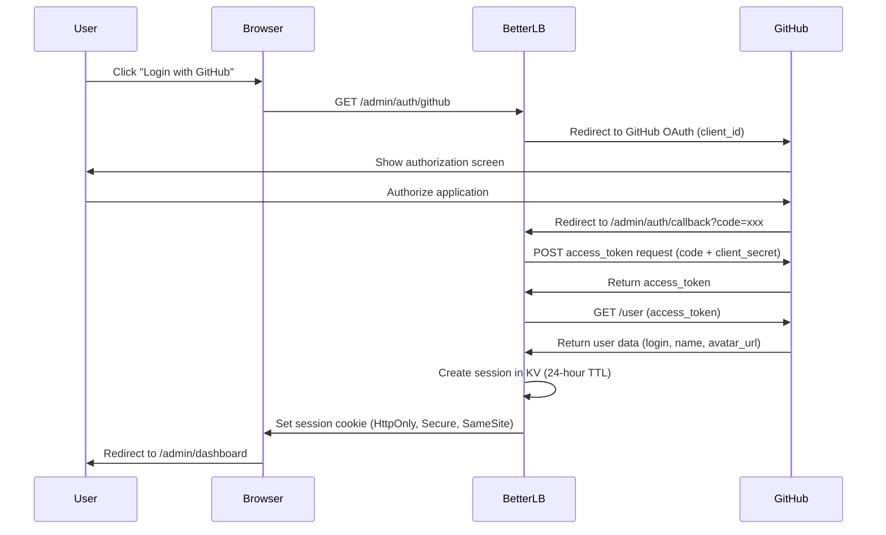

# BetterLB Security Guide

**Version:** 1.0
**Last Updated:** 2026-02-28
**Security Posture:** MEDIUM Risk (improved from HIGH)

---

## Executive Summary

BetterLB is a municipal government portal for Los Baños, Philippines, handling citizen data and legislative records. This guide provides comprehensive documentation of security architecture, implementation patterns, and best practices for developers.

### Key Security Metrics

| Metric | Status |
|--------|--------|
| **Risk Level** | MEDIUM (down from HIGH) |
| **Security Audit** | 8/10 critical+high issues resolved |
| **ESLint Compliance** | ✅ Zero errors |
| **TypeScript Strict Mode** | ✅ Enabled |
| **Test Coverage** | 332 tests (E2E, unit, integration) |
| **CSRF Protection** | ✅ All state-changing endpoints |
| **Audit Logging** | ✅ 13 state-changing operations |
| **Security Headers** | ✅ Comprehensive CSP + defensive headers |
| **CORS** | ✅ Restrictive origin whitelist |
| **RBAC** | ✅ 3-tier role system implemented |

### Recent Security Improvements (February 2026)

1. **CSRF Protection** (T-056) - One-time use tokens with 24-hour TTL
2. **Audit Logging** (T-057) - Comprehensive audit trail for all state changes
3. **Security Headers** (T-058) - Full CSP + X-Frame-Options, HSTS, etc.
4. **CORS Configuration** (T-059) - Origin whitelist (betterlb.gov.ph, localhost)
5. **RBAC System** (T-060) - ADMIN/EDITOR/VIEWER roles with 15 granular permissions

---

## Table of Contents

1. [Security Architecture](#1-security-architecture)
2. [Authentication & Authorization](#2-authentication--authorization)
3. [Data Protection](#3-data-protection)
4. [API Security](#4-api-security)
5. [Development Security](#5-development-security)
6. [Monitoring & Incident Response](#6-monitoring--incident-response)
7. [Compliance & Legal](#7-compliance--legal)
8. [Resources](#8-resources)

---

## 1. Security Architecture

### System Architecture Overview

```
┌─────────────────────────────────────────────────────────────┐
│                     Public Internet                          │
└─────────────────────┬───────────────────────────────────────┘
                      │
                      ▼
┌─────────────────────────────────────────────────────────────┐
│              Cloudflare Pages + Workers                      │
│  ┌──────────────────────────────────────────────────────┐   │
│  │  Frontend (React/Vite)                                │   │
│  │  - Public pages: /services, /government, /statistics │   │
│  │  - Admin dashboard: /admin/*                          │   │
│  └──────────────────────────────────────────────────────┘   │
│  ┌──────────────────────────────────────────────────────┐   │
│  │  API Endpoints (Cloudflare Functions)                 │   │
│  │  - Public APIs: /api/*, /api/openlgu/*                │   │
│  │  - Admin APIs: /api/admin/* (protected)               │   │
│  └──────────────────────────────────────────────────────┘   │
└─────────────────┬───────────────────┬───────────────────────┘
                  │                   │
      ┌───────────▼─────────┐ ┌───────▼──────────┐
      │  Cloudflare D1 DB   │ │  Cloudflare KV    │
      │  (SQLite database)  │ │  (Key-value store)│
      │  - Legislative data │ │  - Sessions       │
      │  - User records     │ │  - CSRF tokens    │
      │  - Audit logs       │ │  - Weather cache  │
      └─────────────────────┘ └───────────────────┘
```

### Threat Model

#### High-Level Threats Addressed

| Threat Category | Mitigation | Status |
|-----------------|------------|--------|
| **Injection Attacks** | Parameterized queries, input validation | ✅ Implemented |
| **Cross-Site Scripting (XSS)** | CSP headers, output encoding | ✅ Implemented |
| **Cross-Site Request Forgery (CSRF)** | Token-based protection | ✅ Implemented |
| **Authentication Bypass** | OAuth + session validation | ✅ Implemented |
| **Authorization Bypass** | RBAC with 15 permissions | ✅ Implemented |
| **Data Exposure** | Encryption at rest + in transit | ✅ Implemented |
| **Denial of Service (DoS)** | Rate limiting (100 req/min) | ✅ Implemented |
| **Insecure Direct Object References** | IDOR checks, RBAC validation | ✅ Implemented |

### Trust Zones

#### Zone 1: Public (Internet)
**Access:** Unauthenticated users
**Data:** Publicly available municipal information
**Endpoints:**
- `/services`, `/government`, `/statistics`, `/about`
- `/api/weather` (public weather data)
- `/api/openlgu/*` (OpenLGU API with rate limiting)

**Security Controls:**
- Rate limiting (100 req/min per IP)
- Input validation and sanitization
- CORS restrictions
- Security headers (CSP, X-Frame-Options, HSTS)

#### Zone 2: Authenticated (Admin Users)
**Access:** GitHub/Google OAuth only
**Data:** Admin dashboard, review queue, audit logs
**Endpoints:**
- `/admin/*` (admin UI)
- `/api/admin/*` (admin API endpoints)

**Security Controls:**
- OAuth 2.0 authentication (GitHub + Google)
- Session management with KV storage (24-hour TTL)
- CSRF protection (one-time use tokens)
- RBAC (ADMIN/EDITOR/VIEWER roles)
- Audit logging (all state changes)

#### Zone 3: Data Layer (D1 + KV)
**Access:** Cloudflare Workers only
**Data:** All application data (legislative records, users, sessions)
**Storage:**
- Cloudflare D1 (SQLite database)
- Cloudflare KV (sessions, CSRF tokens, cache)

**Security Controls:**
- Encryption at rest (Cloudflare-managed)
- Encryption in transit (TLS 1.3)
- No direct database access from internet
- D1 binding via Cloudflare Workers only
- Parameterized queries (SQL injection prevention)

### Security Boundaries

```
┌────────────────────────────────────────────────────┐
│  Boundary 1: Public Internet → Cloudflare Edge     │
│  Protection: TLS, DDoS protection, rate limiting   │
└────────────────────────────────────────────────────┘
                      │
                      ▼
┌────────────────────────────────────────────────────┐
│  Boundary 2: Public → Authenticated Admin           │
│  Protection: OAuth, session validation, CSRF, RBAC │
└────────────────────────────────────────────────────┘
                      │
                      ▼
┌────────────────────────────────────────────────────┐
│  Boundary 3: Workers → Data Layer (D1/KV)          │
│  Protection: No direct access, encrypted storage   │
└────────────────────────────────────────────────────┘
```

---

## 2. Authentication & Authorization

### OAuth 2.0 Flow

BetterLB uses OAuth 2.0 for admin authentication via GitHub and Google.

#### GitHub OAuth Flow



#### Implementation Details

**Files:**
- `functions/api/admin/auth/github.ts` - Initiate GitHub OAuth
- `functions/api/admin/auth/callback.ts` - Handle OAuth callback
- `functions/api/admin/auth-google/callback.ts` - Google OAuth variant
- `functions/utils/admin-auth.ts` - Authentication wrapper

**Session Management:**
```typescript
// Session structure (stored in Cloudflare KV)
interface AdminSession {
  user: {
    login: string;        // GitHub username
    name: string;         // Display name
    avatar_url: string;   // Profile picture
  };
  login_at: string;       // ISO timestamp
  expires_at: string;     // ISO timestamp (24 hours)
  role?: UserRole;        // ADMIN | EDITOR | VIEWER (optional)
}

// Session storage
await env.WEATHER_KV.put(`session:${sessionId}`, JSON.stringify(sessionData), {
  expirationTtl: 86400, // 24 hours
});
```

**Cookie Security:**
- `HttpOnly`: Prevents JavaScript access (XSS protection)
- `Secure`: HTTPS only
- `SameSite=Strict`: CSRF protection
- `Path=/admin`: Limited to admin routes

### CSRF Protection

All state-changing admin endpoints are protected by CSRF tokens.

#### Token Lifecycle

```typescript
// 1. Token generation (on session creation)
const csrfToken = crypto.randomUUID();
await env.WEATHER_KV.put(`csrf:${sessionId}`, csrfToken, {
  expirationTtl: 86400, // 24 hours
});

// 2. Token retrieval (via API endpoint)
// GET /api/admin/auth/csrf
export const onRequestGet = withAuth(async (context) => {
  const csrfToken = await getCSRFTokenForSession(context);
  return new Response(JSON.stringify({ csrfToken }), {
    headers: { 'Content-Type': 'application/json' },
  });
}, { requireCSRF: false }); // CSRF endpoint doesn't require CSRF

// 3. Token validation (on state-changing requests)
const isValid = await validateCSRFToken(sessionId, providedToken, env);
if (!isValid) {
  throw new Error('Invalid CSRF token');
}
```

#### Protected Endpoints

**All POST/PUT/PATCH/DELETE** requests to `/api/admin/*` require:
1. Valid session cookie
2. Valid CSRF token (in `X-CSRF-Token` header)
3. Appropriate RBAC permissions

**Exempt Endpoints:**
- GET requests (read-only, no state change)
- `/api/admin/auth/csrf` (token retrieval)
- `/api/admin/auth/logout` (session termination)

### Role-Based Access Control (RBAC)

#### User Roles

| Role | Permissions | Typical Use Case |
|------|-------------|------------------|
| **ADMIN** | All permissions (15/15) | System administrators, superusers |
| **EDITOR** | Read/write (9/15) | Content editors, data entry staff |
| **VIEWER** | Read-only (5/15) | Stakeholders, auditors, reviewers |

#### Permission Matrix

| Resource | Action | Permission | ADMIN | EDITOR | VIEWER |
|----------|--------|-----------|-------|--------|--------|
| Documents | Read | `documents:read` | ✅ | ✅ | ✅ |
| Documents | Write | `documents:write` | ✅ | ✅ | ❌ |
| Documents | Delete | `documents:delete` | ✅ | ❌ | ❌ |
| Persons | Read | `persons:read` | ✅ | ✅ | ✅ |
| Persons | Write | `persons:write` | ✅ | ✅ | ❌ |
| Persons | Delete | `persons:delete` | ✅ | ❌ | ❌ |
| Persons | Merge | `persons:merge` | ✅ | ❌ | ❌ |
| Sessions | Read | `sessions:read` | ✅ | ✅ | ✅ |
| Sessions | Write | `sessions:write` | ✅ | ✅ | ❌ |
| Review Queue | Read | `review_queue:read` | ✅ | ✅ | ✅ |
| Review Queue | Assign | `review_queue:assign` | ✅ | ✅ | ❌ |
| Review Queue | Status | `review_queue:status` | ✅ | ✅ | ❌ |
| Reconcile | All | `reconcile` | ✅ | ❌ | ❌ |
| Facebook Parse | All | `parse_facebook` | ✅ | ❌ | ❌ |
| Admin Settings | All | `admin:settings` | ✅ | ❌ | ❌ |
| Audit Logs | Read | `admin:audit_logs` | ✅ | ❌ | ❌ |

**Total:** 15 granular permissions

#### Implementation Example

```typescript
// Protect endpoint with RBAC
export const onRequestDelete = withAuth(handleDeleteDocument, {
  requireCSRF: true,
  requirePermission: Permission.DOCUMENTS_DELETE, // Requires ADMIN only
});

// Protect endpoint with role requirement
export const onRequestPost = withAuth(handleSettingsUpdate, {
  requireCSRF: true,
  requireRole: UserRole.ADMIN, // Requires ADMIN role only
});
```

**See also:** `docs/RBAC-IMPLEMENTATION-GUIDE.md` for detailed RBAC usage guide.

### Audit Logging

All state-changing operations are logged for compliance and forensic analysis.

#### Logged Operations (13 endpoints)

| Endpoint | Action | Logged Data |
|----------|--------|-------------|
| `/api/admin/attendance` | POST | Attendance updates |
| `/api/admin/errors` | POST/DELETE | Error retry/deletion |
| `/api/admin/parse-facebook-post` | POST | Facebook post parsing |
| `/api/admin/parse-legislative-post` | POST | Legislative post parsing |
| `/api/admin/reconcile` | POST | Data conflict accept/reject |
| `/api/admin/review-queue` | POST | Review queue creation |
| `/api/admin/auth/logout` | POST | Session termination |
| `/api/admin/persons-deletion-queue` | POST/DELETE/GET | Person deletion operations |
| `/api/admin/persons-merge` | POST | Person record merge |
| `/api/admin/documents` | POST | Document creation |
| `/api/admin/documents/[id]` | PUT/PATCH/DELETE | Document updates/deletion |

#### Audit Log Entry Structure

```typescript
interface AuditLogEntry {
  id: string;              // UUID
  action: string;          // Action performed (e.g., "create_document")
  performed_by: string;    // Admin username
  target_type: string;     // Type of target (e.g., "document", "person")
  target_id: string;       // ID of target
  details: Record<string, unknown>; // Additional context
  created_at: string;      // ISO timestamp
  ip_address?: string;     // Client IP (if available)
}
```

#### Viewing Audit Logs

**Admin UI:** `/admin/audit-logs`
**Features:**
- Filter by action, user, date range
- Paginated results (50 per page)
- CSV export for compliance reporting
- Auto-refresh (every 30 seconds)
- Color-coded action badges

---

## 3. Data Protection

### Encryption

#### Encryption at Rest
- **Database:** Cloudflare D1 (SQLite) with automatic encryption
- **Key-Value Store:** Cloudflare KV with automatic encryption
- **Key Management:** Cloudflare-managed encryption keys

**Note:** BetterLB does not manage encryption keys directly. Cloudflare handles encryption at the infrastructure level.

#### Encryption in Transit
- **TLS Version:** TLS 1.3 required
- **HTTPS Enforcement:** All traffic over HTTPS only
- **HSTS Header:** `Strict-Transport-Security: max-age=31536000`
- **Certificate:** Managed by Cloudflare (automatic renewal)

### Sensitive Data Handling

#### Personally Identifiable Information (PII)

**Types of PII stored:**
1. **Admin Users:**
   - GitHub/Google OAuth profiles (login, name, avatar_url)
   - Session data (stored in KV with 24-hour TTL)

2. **Government Officials:**
   - Names, positions, contact information (public records)
   - Legislative participation data (public records)

3. **Citizens:**
   - No citizen authentication or personal data stored
   - Public data only (municipal services, ordinances)

**Data Minimization Principle:**
- Only collect data necessary for operations
- No unnecessary personal information stored
- Public data treated as potentially sensitive

#### Data Masking/Pseudonymization

**Current Implementation:**
- Admin sessions: Stored with session IDs (UUID), not user IDs directly
- Audit logs: Usernames logged (for accountability), not full profile data

**Future Enhancements:**
- Consider pseudonymization for audit log exports
- Hash sensitive identifiers in analytics

### Key Management

**Current Approach:** Cloudflare-managed encryption keys
- No manual key rotation required
- Keys managed at Cloudflare infrastructure level
- Key access restricted to Cloudflare D1/KV services

**Best Practices:**
- Never commit secrets to git (use environment variables)
- Rotate API keys periodically (e.g., ZAI_API_KEY)
- Use Cloudflare environment variables for production secrets
- Use `.env` files locally only (properly gitignored)

---

## 4. API Security

### Rate Limiting

**Public APIs (OpenLGU):**
- **Limit:** 100 requests per minute per IP address
- **Implementation:** Cloudflare Workers rate limiter
- **Response:** `429 Too Many Requests` with `Retry-After` header

**Admin APIs:**
- No additional rate limiting (protected by authentication + CSRF)
- Session limits: 1 session per user (new login invalidates previous)

### Input Validation

#### Validation Patterns

```typescript
// UUID validation
const isValidId = (id: string): boolean => {
  return /^[0-9a-f]{8}-[0-9a-f]{4}-[0-9a-f]{4}-[0-9a-f]{4}-[0-9a-f]{12}$/i.test(id);
};

// Email validation
const isValidEmail = (email: string): boolean => {
  return /^[^\s@]+@[^\s@]+\.[^\s@]+$/.test(email);
};

// SQL injection prevention (parameterized queries)
const result = await env.DB.prepare(
  'SELECT * FROM documents WHERE id = ?'
).bind(documentId).first();
```

#### Validation Best Practices

1. **Validate all user input** (query params, request bodies, cookies)
2. **Use TypeScript strict mode** (compile-time type checking)
3. **Parameterized database queries** (prevent SQL injection)
4. **Output encoding** (prevent XSS attacks)
5. **Length limits** (prevent DoS via large payloads)

### SQL Injection Prevention

**All database queries use parameterized statements:**

```typescript
// ❌ WRONG: String concatenation (vulnerable to SQL injection)
const query = `SELECT * FROM documents WHERE id = '${userInput}'`;
const result = await env.DB.prepare(query).all();

// ✅ CORRECT: Parameterized query (safe)
const result = await env.DB.prepare(
  'SELECT * FROM documents WHERE id = ?'
).bind(userInput).first();
```

**Enforcement:**
- ESLint rule: `@typescript-eslint/no-explicit-any` (prevents untyped queries)
- Code review checklist: Check all `env.DB.prepare()` calls
- Security audit: Verified all queries use `.bind()` or `.bind()`

### XSS Protection

#### Content Security Policy (CSP)

```
Content-Security-Policy:
  default-src 'self';
  script-src 'self' 'unsafe-inline' 'unsafe-eval';
  style-src 'self' 'unsafe-inline';
  img-src 'self' data: https:;
  font-src 'self' data:;
  connect-src 'self' https://*.githubusercontent.com;
  frame-ancestors 'none';
  base-uri 'self';
  form-action 'self';
```

**Key Directives:**
- `default-src 'self'`: Only load resources from same origin
- `script-src 'self'`: No external scripts (except inline for React)
- `frame-ancestors 'none'`: Prevent clickjacking
- `form-action 'self'`: Prevent form submission to external sites

#### Additional XSS Protections

- **Output Encoding:** React automatically escapes JSX content
- **HTTP-only Cookies:** Prevent JavaScript access to session cookies
- **X-XSS-Protection:** `X-XSS-Protection: 0` (deprecated, CSP preferred)

### CORS Configuration

**Allowed Origins:**
```typescript
const ALLOWED_ORIGINS = [
  'https://betterlb.pages.dev',     // Production
  'https://betterlb.gov.ph',        // Custom domain
  'http://localhost:5173',          // Vite dev server
  'http://localhost:8788',          // Wrangler dev server
];
```

**CORS Headers:**
```
Access-Control-Allow-Origin: <matched origin>
Access-Control-Allow-Methods: GET, POST, PUT, PATCH, DELETE, OPTIONS
Access-Control-Allow-Headers: Content-Type, Authorization, X-CSRF-Token
Access-Control-Allow-Credentials: true
Access-Control-Max-Age: 86400
```

**Preflight Requests:**
- OPTIONS requests handled with 204 No Content
- CORS headers applied to all responses

### Security Headers

#### Defensive Headers

```typescript
// Implemented in functions/utils/security-headers.ts
const securityHeaders = {
  'X-Content-Type-Options': 'nosniff',           // Prevent MIME sniffing
  'X-Frame-Options': 'DENY',                      // Prevent clickjacking
  'Strict-Transport-Security': 'max-age=31536000', // Enforce HTTPS
  'X-XSS-Protection': '0',                        // CSP preferred
  'Referrer-Policy': 'strict-origin-when-cross-origin', // Control referrer leakage
  'Permissions-Policy': 'geolocation=(), microphone=(), camera=()', // Disable features
};
```

**Applied to:**
- All API responses (via `cachedJson()` utility)
- All HTML responses (via `functions/index.ts`)

**See also:** `docs/security-headers-implementation-summary.md`

---

## 5. Development Security

### Secure Coding Guidelines

#### 1. Input Validation

**Always validate user input:**

```typescript
// ✅ Validate UUIDs
if (!isValidId(documentId)) {
  throw new Error('Invalid document ID');
}

// ✅ Validate required fields
if (!body.title || typeof body.title !== 'string') {
  throw new Error('Title is required and must be a string');
}

// ✅ Validate ranges
if (page < 1 || page > 1000) {
  throw new Error('Page number out of range');
}
```

#### 2. Error Handling

**Never expose sensitive information in errors:**

```typescript
// ❌ WRONG: Exposes database structure
throw new Error(`Database error: ${err.message} in table users`);

// ✅ CORRECT: Generic error message
console.error('Database error:', err); // Log details server-side
throw new Error('An error occurred while processing your request');
```

#### 3. Logging

**Log security-relevant events:**

```typescript
// Use audit logging for state changes
await logAudit(env, {
  action: AuditActions.CREATE_DOCUMENT,
  performedBy: context.auth.user.login,
  targetType: AuditTargetTypes.DOCUMENT,
  targetId: documentId,
  details: { title: document.title, type: document.type },
});
```

#### 4. Authentication Checks

**Never skip authentication for admin endpoints:**

```typescript
// ❌ WRONG: No authentication
export const onRequestDelete = async (context) => {
  await deleteDocument(context);
};

// ✅ CORRECT: Protected with withAuth
export const onRequestDelete = withAuth(handleDelete, {
  requireCSRF: true,
  requirePermission: Permission.DOCUMENTS_DELETE,
});
```

### Code Review Checklist

Use this checklist when reviewing or submitting code:

#### Authentication & Authorization
- [ ] Admin endpoints use `withAuth()` wrapper
- [ ] State-changing endpoints require CSRF token (`requireCSRF: true`)
- [ ] Appropriate RBAC permissions checked (`requirePermission`)
- [ ] No hardcoded credentials or API keys
- [ ] Session validation performed before sensitive operations

#### Data Handling
- [ ] All database queries use parameterized statements (`.bind()`)
- [ ] User input is validated (type, length, format)
- [ ] Error messages don't expose sensitive data
- [ ] PII is handled appropriately (logged, stored, transmitted)
- [ ] Audit logging added for state changes

#### API Security
- [ ] Rate limiting applied to public APIs
- [ ] CORS headers properly configured
- [ ] Security headers included in responses
- [ ] Output encoding for XSS prevention
- [ ] SQL injection prevention (parameterized queries)

#### Testing
- [ ] Unit tests cover security-critical code paths
- [ ] Integration tests validate auth/authz flows
- [ ] E2E tests verify user-facing security features
- [ ] No hardcoded test credentials in production code

#### Dependencies
- [ ] `npm audit` shows no high/critical vulnerabilities
- [ ] Dependencies updated to latest stable versions
- [ ] New dependencies reviewed for security practices

### Dependency Management

#### Automated Scanning

```bash
# Run security audit
npm audit

# Fix vulnerabilities automatically
npm audit fix

# Check for outdated packages
npm outdated
```

#### Dependency Update Policy

**Frequency:** Monthly dependency review
**Critical Vulnerabilities:** Update immediately within 7 days
**High Vulnerabilities:** Update within 30 days
**Medium/Low:** Update at next scheduled review

#### Supply Chain Security

- **Private Registry:** Not currently used (npm public registry)
- **Package Lock:** `package-lock.json` committed (ensures reproducible builds)
- **Integrity Checks:** npm automatically verifies package integrity
- **Future Enhancement:** Consider `npm ci` in CI/CD for deterministic installs

### Secret Management

#### Environment Variables

**Development:**
- Use `.env` file (gitignored)
- Template: `.env.example` (committed)

**Production:**
- Cloudflare Workers environment variables
- Set via Cloudflare Dashboard or Wrangler CLI
- Never log or echo secrets in output

#### Secret Rotation

**Recommended Schedule:**
- **API Keys:** Every 90-180 days
- **OAuth Secrets:** Every 365 days (or if compromised)
- **Session Keys:** Automatic (CSRF tokens expire after 24 hours)

**Rotation Process:**
1. Generate new secret
2. Update environment variable in Cloudflare
3. Test with new secret
4. Invalidate old secret (if applicable)

### Testing for Security

#### Security Test Coverage

**Unit Tests:**
- CSRF token generation and validation
- RBAC permission checks
- Input validation functions
- Audit logging utilities

**Integration Tests:**
- OAuth flow (GitHub, Google)
- Session management
- Protected endpoint access
- CSRF protection on state changes

**E2E Tests:**
- Admin login flow
- Permission-based access control
- CSRF token handling
- Session timeout

**Current Coverage:** 332 tests (E2E, unit, integration)

#### Penetration Testing

**Recommended Schedule:** Annual penetration test
**Scope:** Public-facing endpoints, admin dashboard, authentication flows
**Methodology:** OWASP Testing Guide or similar standard
**Reporting:** Document findings, remediate, verify fixes

---

## 6. Monitoring & Incident Response

### Security Monitoring

#### What to Monitor

1. **Authentication Events**
   - Failed login attempts
   - Successful logins from unusual locations
   - Multiple sessions for same user
   - Session expiration anomalies

2. **Authorization Failures**
   - Access denied errors (403)
   - Permission escalation attempts
   - RBAC violations

3. **API Security**
   - Rate limit violations (429 responses)
   - CSRF token failures
   - Invalid session tokens
   - SQL injection attempts

4. **Data Integrity**
   - Failed database operations
   - Unexpected data modifications
   - Bulk export operations

#### Monitoring Tools

**Current Implementation:**
- **Audit Logs:** `/admin/audit-logs` UI for review
- **Cloudflare Analytics:** Request metrics, error rates
- **GitHub Actions CI/CD:** Build/test failure notifications

**Recommended Enhancements:**
- **Error Tracking:** Sentry or similar for production errors
- **Log Aggregation:** Cloudflare Logs or external service
- **Alerting:** PagerDuty or similar for critical security events

### Incident Response

#### Incident Classification

| Severity | Description | Example | Response Time |
|----------|-------------|---------|---------------|
| **P0 - Critical** | System compromise, data breach | Confirmed unauthorized access | 1 hour |
| **P1 - High** | Significant security control failure | CSRF bypass, authentication bypass | 4 hours |
| **P2 - Medium** | Potential security issue | Suspicious activity, failed exploit | 24 hours |
| **P3 - Low** | Minor security issue | Missing security header, policy violation | 7 days |

#### Response Procedures

**P0 - Critical (Data Breach/System Compromise)**
1. **Immediate (0-1 hour):**
   - Activate incident response team
   - Contain incident (disable affected systems if necessary)
   - Preserve evidence (logs, timestamps)
2. **Short-term (1-24 hours):**
   - Assess scope and impact
   - Notify stakeholders (legal, PR, management)
   - Begin forensic analysis
3. **Recovery (1-7 days):**
   - Patch vulnerabilities
   - Restore from backups if needed
   - Implement additional monitoring
   - Public communication (if required)

**P1 - High (Security Control Failure)**
1. **Assessment (0-4 hours):**
   - Verify vulnerability
   - Check for exploitation (logs review)
   - Estimate impact
2. **Fix (4-24 hours):**
   - Develop patch
   - Test patch thoroughly
   - Deploy to production
3. **Post-Incident:**
   - Document root cause
   - Update security tests
   - Review similar code for same issue

**P2 - Medium (Potential Issue)**
1. **Investigation (0-24 hours):**
   - Confirm if actual security issue
   - Assess risk level
   - Determine if immediate action needed
2. **Remediation:**
   - Schedule fix based on risk
   - Monitor for related activity

**P3 - Low (Minor Issue)**
1. **Documentation:**
   - Log issue in backlog
   - Schedule fix at next maintenance window
   - Update security checklist

#### Escalation Matrix

```
┌─────────────────────────────────────────────────┐
│  Level 1: On-Call Developer                      │
│  - P3 issues: Fix within 7 days                 │
│  - P2 issues: Escalate to Level 2               │
└─────────────────────────────────────────────────┘
                      │
                      ▼
┌─────────────────────────────────────────────────┐
│  Level 2: Tech Lead / Senior Developer          │
│  - P2 issues: Investigate within 24 hours       │
│  - P1 issues: Escalate to Level 3               │
└─────────────────────────────────────────────────┘
                      │
                      ▼
┌─────────────────────────────────────────────────┐
│  Level 3: Project Manager + Team                │
│  - P1 issues: Fix within 4-24 hours             │
│  - P0 issues: Escalate to Level 4               │
└─────────────────────────────────────────────────┘
                      │
                      ▼
┌─────────────────────────────────────────────────┐
│  Level 4: Executive + Legal + PR                │
│  - P0 issues: Immediate response, public        │
│    communication, legal compliance              │
└─────────────────────────────────────────────────┘
```

#### Communication Plan

**Internal Communication:**
- **Slack/Discord:** Real-time incident updates
- **Email:** Formal incident reports
- **GitHub Issues:** Track remediation tasks

**External Communication (if required):**
- **Security Advisory:** Post on SECURITY.md
- **User Notification:** Email/banner on website
- **Media Coordination:** PR team for public incidents

---

## 7. Compliance & Legal

### Data Protection Laws

**Philippines: Data Privacy Act of 2012 (DPA)**
- BetterLB handles government data (public records)
- PII limited to admin users (consent via OAuth)
- Municipal data is publicly available information
- Data access restricted to authenticated admin users

**General Data Protection Regulation (GDPR)**
- May apply if EU citizens access the platform
- Consider GDPR compliance for future enhancements
- Current data minimization approach aligns with GDPR principles

### Audit Requirements

**Internal Audits:**
- **Security Audit:** Completed February 2026 (T-028)
- **Code Quality Audit:** Completed February 2026 (T-032)
- **Documentation Audit:** Completed February 2026 (T-035)
- **Accessibility Audit:** Completed February 2026 (T-031)

**External Audits:**
- None currently required (municipal project)
- Future: Consider annual third-party security audit

### Retention Policies

**Data Retention:**

| Data Type | Retention Period | Rationale |
|-----------|------------------|-----------|
| Admin Sessions | 24 hours | Security best practice |
| CSRF Tokens | 24 hours | Security best practice |
| Weather Cache | 1-24 hours | Data freshness |
| Audit Logs | Indefinite | Compliance & forensic analysis |
| Legislative Records | Indefinite (public records) | Legal requirement |
| User Data (OAuth profiles) | Until account deletion | Operational necessity |

**Log Retention:**
- Audit logs: Indefinite (stored in D1 database)
- Cloudflare logs: Per Cloudflare retention policy
- Application logs: Not currently persisted (consider adding)

### Reporting Obligations

**Security Incidents:**
- **Data Breaches:** Report to National Privacy Commission (NPC) within 72 hours (if applicable)
- **System Outages:** Report to stakeholders as per SLA
- **Security Vulnerabilities:** Coordinate with security researchers via SECURITY.md

**Transparency Reporting:**
- Consider publishing annual transparency report
- Document security improvements in changelog
- Maintain SECURITY.md with current features

---

## 8. Resources

### Internal Documentation

**Security Guides:**
- `SECURITY.md` - Vulnerability reporting policy
- `docs/SECURITY-GUIDE.md` - This document
- `docs/PRIVACY.md` - Privacy documentation
- `docs/RBAC-IMPLEMENTATION-GUIDE.md` - RBAC usage guide

**Security Audit Reports:**
- `docs/security-audit.md` - Comprehensive security audit (February 2026)
- `docs/security-audit-review-summary.md` - Audit review summary
- `docs/security-audit-update-2026-02-27.md` - Audit progress update

**Implementation Summaries:**
- `docs/security-headers-implementation-summary.md` - Security headers
- `docs/RBAC-IMPLEMENTATION-GUIDE.md` - RBAC system
- `docs/csrf-implementation.md` - CSRF protection (if exists)

**Developer Guides:**
- `CLAUDE.md` - Project documentation (see Audit Logging Pattern section)
- `docs/DEVELOPER_GUIDE.md` - Developer onboarding guide

### External References

**Security Standards:**
- [OWASP Top 10](https://owasp.org/www-project-top-ten/) - Web application security risks
- [OWASP Testing Guide](https://owasp.org/www-project-web-security-testing-guide/) - Security testing methodology
- [CWE/SANS Top 25](https://cwe.mitre.org/top25/) - Common software weaknesses

**Cloudflare Security:**
- [Cloudflare D1 Security](https://developers.cloudflare.com/d1/) - Database security
- [Cloudflare Workers Security](https://developers.cloudflare.com/workers/) - Serverless security
- [Cloudflare KV Security](https://developers.cloudflare.com/kv/) - Key-value store security

**OAuth 2.0:**
- [OAuth 2.0 Specification (RFC 6749)](https://datatracker.ietf.org/doc/html/rfc6749)
- [OAuth 2.0 for Browser-Based Apps (RFC 8252)](https://datatracker.ietf.org/doc/html/rfc8252)

**Data Privacy:**
- [Philippines Data Privacy Act of 2012](https://privacy.gov.ph/data-privacy-act/)
- [GDPR Text](https://gdpr-info.eu/)

### Training Materials

**For Developers:**
- Security chapter in `docs/DEVELOPER_GUIDE.md`
- Code review checklist (see Section 5.2)
- RBAC implementation guide
- Audit logging pattern documentation

**For Users:**
- Public privacy policy (from `docs/PRIVACY.md`)
- Security contact information (SECURITY.md)

### Security Tools

**Development Tools:**
- `npm audit` - Dependency vulnerability scanning
- ESLint (`@typescript-eslint`) - Code quality and security patterns
- TypeScript strict mode - Type safety

**Testing Tools:**
- Vitest - Unit testing framework
- Playwright - E2E testing with security test support
- OWASP ZAP - (optional) Penetration testing tool

**Monitoring Tools:**
- Cloudflare Analytics - Request metrics, error rates
- Cloudflare Logs - Request/response logs
- (Future) Sentry - Error tracking and alerting

---

## Appendix A: Security Posture Timeline

| Date | Event | Risk Level |
|------|-------|------------|
| 2026-02-03 | Initial Security Audit | HIGH (25 vulnerabilities) |
| 2026-02-27 | Security Improvements Complete | MEDIUM (8/10 critical+high fixed) |
| 2026-02-28 | Documentation Complete | MEDIUM (comprehensive docs) |

**Current Status:** MEDIUM risk with comprehensive security controls in place

---

## Appendix B: Quick Reference

### Critical Security Contacts

- **Security Disclosures:** security@bettergov.ph (update to betterlb.gov.ph)
- **Incident Response:** On-call developer (via Slack)
- **Legal/Privacy:** [To be assigned]

### Essential Security Commands

```bash
# Run security audit
npm audit

# Check for vulnerabilities
npm audit fix

# Run tests with security focus
npm run test

# Check code quality (ESLint)
npm run lint

# Type checking
npx tsc --noEmit
```

### Security Checklist for New Features

- [ ] Input validation on all user input
- [ ] Parameterized database queries
- [ ] Authentication checks (if admin feature)
- [ ] CSRF protection (if state-changing)
- [ ] RBAC permission checks (if admin feature)
- [ ] Audit logging (if state-changing)
- [ ] Error handling (no sensitive data exposure)
- [ ] Security headers applied
- [ ] CORS properly configured
- [ ] Tests written (unit, integration, E2E)

---

**Document Version:** 1.0
**Last Reviewed:** 2026-02-28
**Next Review Date:** 2026-05-28 (quarterly review recommended)

---

**Maintained by:** BetterLB Development Team
**Questions?** Refer to `docs/DEVELOPER_GUIDE.md` or open a GitHub issue.
